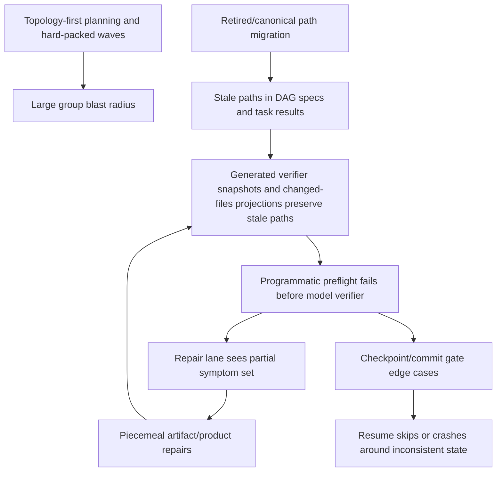

# DAG Pipeline Retrospective

Feature: `8ac124d6`  
Scope: groups 0-38, with emphasis on groups 28-38  
Evidence snapshot: local Postgres and worktree research on 2026-05-06, while G38 was still active (`event:24259` through `event:24277`).

## Executive Summary

### Facts

- The late execution tail was dominated by retry-loop amplification, not only by product bugs. Groups 28-38 generated far more preflight, reconcile, repair, and expanded verify artifacts than groups 0-25; G30 alone had 19 verifier finishes and 15 repair cycles before checkpoint (`query:q-g28-g38-forensics`, `event:20232`, `event:20233`).
- The largest repeat failure mode was stale derived state: `dag-task:*` rows, generated expanded verify snapshots, changed-files projections, task specs, and DAG/planning artifacts could each preserve retired paths after the product code moved to canonical paths (`artifact:dag-repair-preflight:g30:retry-initial id=1044830`, `artifact:dag-task-spec-reconcile:g38:retry-initial id=1351097`, `docs/dag-execution-learnings.md:53`).
- The workflow did useful work after the stale-state fixes. G38 moved from early preflight/permission/commit blockers into concrete product failures such as materialization/symlink mismatch, pytest collection, ChatSidepaneShell accessibility contract drift, and invalid backend Alembic mirror content (`artifact:dag-verify:g38:retry-1 id=1326086`, `artifact:dag-verify:g38:initial id=1351629`, `event:24113`).
- There was at least one correctness leak in checkpointing: G37 wrote `dag-group:37` immediately after a failed raw verifier/preflight artifact (`artifact:dag-verify:g37:initial id=1273016`, `artifact:dag-group:37 id=1273018`, `event:23309`, `event:23310`).
- The planning layer is topology-first. It normalizes same-wave explicit dependency edges, but it does not score semantic coupling, shared generated artifacts, migration risk, or verifier blast radius before packing waves (`task_planning.py:_normalize_subfeature_execution_order lines 3152-3266`, `task_planning.py:5158-5175`, `planning_lead/prompt.md:61-71`).

### Hypotheses

- Hard-packed 20-task waves increased the probability that one stale path or one shared integration defect would block unrelated work in the same group. This is supported by G30/G36/G38 retry counts, but the exact counterfactual requires replaying the same DAG through alternate grouping (`query:q-g28-g38-metrics`, `docs/dag-execution-learnings.md:24-32`).
- The workflow has too many places that can act authoritative without an explicit authority model. Append-latest `dag-task:*` rows, runtime-canonicalized task specs, generated snapshots, mirror files, handover context, and DB artifacts can all feed later prompts or resume state unless the host regenerates them from a clear source (`storage/artifacts.py:25-53`, `implementation.py:_implement_dag lines 2742-2850`, `implementation.py:_verify_and_fix_group lines 1935-1971`).
- Some implementation speed gains from larger waves were real in healthy groups, but the retry tail erased those gains once stale metadata entered the loop. G20-G25 were faster per task than G0-G19 in the seed metric, while G30 consumed about 16h16m by itself (`docs/dag-execution-learnings.md:19-32`, `query:q-g20-g25-metrics`, `query:q-g30-forensics`).

### Conclusions

- The durable fix direction is architectural: define artifact authority, regenerate disposable projections, add integration barriers, and make checkpoint/commit/preflight gates raw and non-suppressible. More local stale-path patches will likely move leakage to the next projection layer (`artifact:dag-task-spec-reconcile:g38:retry-initial id=1351097`, `artifact:dag-commit-failure:g38:retry-0 id=1316714`, `implementation.py:_run_dag_group_preflight lines 9169-9185`).
- The current DAG executor should remain append-only for compatibility, but the host must own reconciliation and projection regeneration rather than relying on agent-authored artifact edits (`storage/artifacts.py:get_record/put lines 36-53`, `implementation.py:DagTaskReconcileOutcome lines 8385-8396`).
- Execution time should be optimized around end-to-end group convergence, not initial task dispatch. The key metric should be "time to checkpoint with verified commit/no-dirty proof" plus retry-cycle count, not just "time until 20 agents finish" (`event:20233`, `event:23310`, `query:q-g28-g38-forensics`).

## Evidence Method

The investigation used primary local sources only:

- Read-only Postgres queries against `features`, `artifacts`, and `events` for feature `8ac124d6`.
- Current worktree source inspection of the implementation phase, runner, Slack orchestrator, artifact store/mirror, planning phase, models, and bugfix queue.
- Existing local learning note `docs/dag-execution-learnings.md`.
- Read-only subagent workstreams for artifact forensics, architecture/code review, and planning/grouping review.

Citation labels used below:

- `query:q-g28-g38-forensics`: grouped artifacts and events by `gNN` artifact keys, artifact JSON `group_idx`, event metadata `group_idx`, and source/content group tags. Snapshot time was 2026-05-06 12:09:36 -07.
- `query:q-g28-g38-metrics`: grouped artifact metrics by group, including row counts, preflight counts, verify counts, expanded verify counts, fix/RCA counts, reconcile counts, and max artifact size.
- `query:q-g0-g19-metrics`: same grouped artifact metric query restricted to groups 0-19.
- `query:q-g20-g25-metrics`: seed timing comparison for healthy packed waves, cross-checked against `docs/dag-execution-learnings.md`.
- `query:q-g20-g27-metrics`: same grouped artifact metric query restricted to groups 20-27.
- `query:q-g30-forensics`: event/artifact drilldown for G30 dispatches, verify finishes, repair cycles, checkpoint, and representative repair artifacts.
- `query:q-feature-wide-counts`: feature-wide counts for artifact rows and event types.
- `query:q-checkpoints`: latest `dag-group:*` artifacts and checkpoint events.

## Timeline And Metrics

### Feature-Wide Snapshot

The feature had 12,827 artifact rows from 2026-04-14 21:56:56 -07 through 2026-05-06 12:02:06 -07. The event stream included 7,775 `agent_start`, 7,379 `agent_done`, 110 `dag_verify_start`, 107 `dag_verify_finish`, 73 `dag_expanded_verify_start`, 73 `dag_repair_cycle_start`, 291 `dag_task_start`, 272 `dag_task_finish`, 5 `phase_execute_error`, 1 `dag_commit_failed`, and 1 `agent_stalled` (`query:q-feature-wide-counts`).

`dag-group:*` checkpoints existed for groups 0-37 only; no `dag-group:38` was present in the snapshot (`query:q-checkpoints`). This means G38 was still unresolved, even though it had moved beyond many stale-path preflight blockers (`artifact:dag-repair-preflight:g38:retry-initial id=1351098`, `artifact:dag-verify:g38:initial id=1351629`).

### Groups 0-19: Natural Small Waves

`docs/dag-execution-learnings.md` records that groups 0-19 covered 35 tasks, mostly in 1-2 task natural waves, with 40 verifier runs and 0 programmatic preflight failures. It estimates 21h36m raw wall time, including a 9h32m idle gap in G16, and about 12h04m adjusted active time, or about 20.7 min/task (`docs/dag-execution-learnings.md:19-23`).

The important fact is not that small waves were always fastest. The important fact is that they localized failures well: the query pass found no programmatic preflight artifacts for G0-G19, and artifact row counts per group stayed small compared with late groups (`query:q-g0-g19-metrics`, `docs/dag-execution-learnings.md:23`).

### Groups 20-27: Hard-Packed Waves And Onset Of Structural Tail

G20 onward switched to hard-packed 20-task waves (`docs/dag-execution-learnings.md:24`). Healthy packed waves were competitive: G20-G25 covered 120 tasks in about 33h56m, roughly 17 min/task raw (`docs/dag-execution-learnings.md:25-26`).

The structural tail became visible at G26-G27. G26 produced 976 artifact rows, 31 preflight artifacts, 31 verify artifacts, 21 expanded verify artifacts, and 15 fix artifacts; G27 produced 427 artifact rows, 14 preflight artifacts, 14 verify artifacts, 9 expanded verify artifacts, and 9 fix artifacts (`query:q-g20-g27-metrics`). That pattern looks like the transition from product verification to process/reconciliation-heavy execution.

### Groups 28-38: Retry Tail Dominates

| Group | Window (-07) | Artifact rows | Preflights | Verifies | Expanded verifies | Fixes | RCA | Task/spec reconciles | Interpretation |
|---:|---|---:|---:|---:|---:|---:|---:|---:|---|
| 28 | Apr 28 12:58 -> Apr 29 13:17 | 955 | 30 | 30 | 19 | 18 | 1 | 0 / 0 | Heavy stale metadata cycle before reconciler era (`query:q-g28-g38-metrics`). |
| 29 | Apr 29 13:18 -> Apr 29 21:47 | 275 | 10 | 9 | 6 | 5 | 1 | 5 / 0 | DB task-result reconciliation starts appearing (`query:q-g28-g38-metrics`). |
| 30 | Apr 29 21:47 -> Apr 30 14:04 | 622 | 19 | 19 | 13 | 9 | 1 | 19 / 2 | Stale chat path closure loop plus later environment blocker (`artifact:dag-repair-triage:g30:retry-0 id=1078324`, `artifact:dag-verify:g30:initial id=1084035`). |
| 31 | Apr 30 14:04 -> May 1 02:20 | 301 | 8 | 8 | 6 | 5 | 2 | 8 / 8 | Reconciliation active each attempt (`query:q-g28-g38-metrics`). |
| 32 | May 1 02:20 -> May 1 10:47 | 81 | 7 | 7 | 4 | 4 | 4 | 7 / 7 | Lower parallelism improved observability, but verification/revision still dominated (`docs/dag-execution-learnings.md:30-32`). |
| 33 | May 1 10:47 -> May 1 23:59 | 116 | 10 | 10 | 6 | 6 | 6 | 10 / 10 | Continued retry tail (`query:q-g28-g38-metrics`). |
| 34 | May 1 23:59 -> May 3 20:45 | 132 | 11 | 11 | 7 | 6 | 7 | 11 / 11 | Long wall-clock window and 10 task errors in event forensics (`query:q-g28-g38-forensics`). |
| 35 | May 3 20:45 -> May 4 00:14 | 37 | 3 | 3 | 2 | 2 | 2 | 3 / 3 | Smaller tail (`query:q-g28-g38-metrics`). |
| 36 | May 4 00:14 -> May 4 12:01 | 187 | 16 | 16 | 10 | 10 | 10 | 16 / 16 | High retry density again (`query:q-g28-g38-metrics`). |
| 37 | May 4 12:01 -> May 5 01:55 | 48 | 4 | 4 | 2 | 2 | 2 | 5 / 5 | Checkpoint after failed raw verifier/preflight (`artifact:dag-verify:g37:initial id=1273016`, `artifact:dag-group:37 id=1273018`). |
| 38 | May 5 01:55 -> May 6 12:08 | 333 | 26 | 26 | 18 | 18 | 18 | 26 / 26 | Active, not checkpointed; mixed stale-state cleanup, permissions, commit failure, and real product defects (`event:24113`, `artifact:dag-verify:g38:initial id=1351629`). |

## Detailed Case Studies

### G30: Artifact/Projection Closure Tail

Facts:

- G30 dispatched the same 20-task group twice before completion (`event:18606`, `event:18714`).
- Early preflight found stale `dag-task` metadata for `chat-sidepane-shell-slice-3-TASK-chat-util-dedup`, including retired `src/vs/workbench/contrib/studioWorkflow/browser/workflowTab/chat/util/eventDeduplicator.ts` and test paths (`artifact:dag-repair-preflight:g30:retry-initial id=1044830`).
- Later preflights found product workspace/index drift for the same retired chat prefix, which required product cleanup rather than artifact-only repair (`artifact:dag-repair-preflight:g30:retry-initial id=1049990`).
- A later preflight expanded the stale source to task specs and DAG fragments, including `dag-fragment:chat-sidepane-shell:slice-1` and retired chat paths in task specs (`artifact:dag-repair-preflight:g30:retry-initial id=1052604`).
- G30 did not reach a clean model verifier until preflight became empty; one late non-product blocker was pgserver shared-memory exhaustion (`artifact:dag-repair-preflight:g30:retry-initial id=1077151`, `artifact:dag-repair-triage:g30:retry-0 id=1078324`).
- G30 finally passed and checkpointed at `artifact:dag-verify:g30:initial id=1084035`, `event:20232`, and `event:20233`.

Interpretation:

G30 demonstrates sequential discovery of stale state across layers. The product code was moving toward canonical `src/webviews/projectSurface/src/chat`, but stale rows/projections/fragments continued to reintroduce retired `src/vs/workbench/contrib/studioWorkflow/browser/workflowTab/chat` paths (`artifact:dag-repair-preflight:g30:retry-initial id=1044830`, `artifact:dag-repair-preflight:g30:retry-initial id=1052604`). This is why artifact closure and task-spec reconciliation reduced churn later, but it also shows that closure has to operate on typed stale signatures rather than every path string in verifier context (`implementation.py:_build_dag_artifact_closure_scan lines 5572-5605`).

Hypothesis:

If G30 had been split by semantic surface, the stale chat relocation issue would not have blocked unrelated backend, bridge, and lifecycle tasks in the same verification unit. This is plausible because planning currently optimizes explicit dependency topology, not semantic blast radius (`planning_lead/prompt.md:61-71`, `task_planning.py:5657-5660`).

### G37: Checkpoint After Failed Raw Preflight

Facts:

- G37 had real product/workspace issues earlier, including forbidden orphan chat files and missing canonical slice-9 deliverables (`artifact:dag-repair-preflight:g37:retry-initial id=1268748`, `artifact:dag-verify:g37:initial id=1268749`, `artifact:dag-verify-rca:g37:retry-0 id=1269796`, `artifact:dag-verify-rca:g37:retry-1 id=1271328`).
- Repairs were recorded before the final checkpoint attempt (`artifact:dag-fix:g37:retry-0 id=1270258`, `artifact:dag-fix:g37:retry-1 id=1272196`).
- The final recorded G37 verifier artifact still failed deterministic preflight on a manifest-forbidden workspace/index path (`artifact:dag-verify:g37:initial id=1273016`).
- `dag-group:37` was written immediately afterward (`artifact:dag-group:37 id=1273018`, `event:23309`, `event:23310`).

Interpretation:

G37 is a process correctness bug, not just a product defect. A raw preflight failure should never be neutralized by ledger dedupe, display suppression, or checkpoint path confusion. The group checkpoint should require raw verifier approval plus either a successful commit hash or an explicit no-dirty proof (`implementation.py:_verify_and_fix_group lines 1997-2050`, `implementation.py:_implement_dag lines 2748-2751`).

Recommendation linkage:

The fix class is a non-suppressible gate model: raw deterministic preflight verdicts, commit outcomes, and hygiene blockers should be checkpoint inputs, not findings that can disappear through display dedupe (`artifact:dag-verify:g37:initial id=1273016`, `implementation.py:_run_dag_group_preflight lines 9169-9185`).

### G38: From Stale State To Product Verification, With Commit And Permission Drag

Facts:

- G38 had no `dag-group:38` checkpoint as of the snapshot (`query:q-checkpoints`).
- Early G38 blockers included backend/package permission failures and a blocked task execution for `TASK-SF8-S4-3` (`event:23395`, `artifact:dag-verify-rca:g38:retry-0 id=1278566`, `artifact:dag-verify-rca:g38:retry-1 id=1279962`).
- G38 had repeated canonicalization of backend `src/iriai_studio_backend/...` paths into canonical package-root paths, with the latest canonicalization artifact recording 33 rewrites (`artifact:dag-path-canonicalization:g38 id=1351094`).
- Latest task-result reconciliation replaced in-memory rows from valid latest DB rows for backend tasks such as `TASK-SF8-S3-4` and `TASK-SF8-S4-3` (`artifact:dag-task-reconcile:g38:retry-initial id=1351096`).
- Latest task-spec reconciliation rehydrated stale projections from source fragments and replaced dashboard/chat retired paths with canonical projectSurface paths (`artifact:dag-task-spec-reconcile:g38:retry-initial id=1351097`).
- The latest preflight was clean before model verification (`artifact:dag-repair-preflight:g38:retry-initial id=1351098`).
- Real product failures then surfaced: materialize copy/symlink mismatch (`artifact:dag-verify:g38:initial id=1321878`, `artifact:dag-verify-rca:g38:retry-0 id=1323043`), pytest collection bug (`artifact:dag-verify:g38:retry-0 id=1324207`, `artifact:dag-verify-rca:g38:retry-1 id=1325371`), ChatSidepaneShell landmark label drift (`artifact:dag-verify:g38:retry-1 id=1326086`), and backend compile/regression failures around an invalid Alembic mirror and backend tests (`artifact:dag-verify:g38:initial id=1351629`, `artifact:dag-repair-lens:g38:regression-downstream:retry-0 id=1352630`).
- G38 also had a commit failure artifact after an attempted repair, with backend commit success and `iriai-studio` precommit/hygiene failure (`artifact:dag-commit-failure:g38:retry-0 id=1316714`, `event:24113`).

Interpretation:

G38 is mixed. The stale/projection class was materially improved by host reconciliation: preflight became empty (`artifact:dag-repair-preflight:g38:retry-initial id=1351098`). But the group still paid for environment/workspace problems, commit hygiene, and real product defects. This argues against "stale metadata is the only problem"; it also argues for moving permission/hygiene/commit gates earlier so model verification is reserved for product semantics (`implementation.py:_dag_workspace_writeability_problems call lines 2859-2902`, `implementation.py:_commit_repos_in_root lines 3625-3668`).

## Artifact Authority Map

| State class | Examples | Current role | Desired authority rule |
|---|---|---|---|
| Product source and git index | `repos/iriai-studio`, `repos/iriai-studio-backend`, staged deletes/adds | Authoritative for product truth and commitability (`artifact:dag-commit-failure:g38:retry-0 id=1316714`) | Must pass hygiene, forbidden path, writeability, tests, and commit/no-dirty gates before checkpoint. |
| Planning source DAG | `dag`, subfeature `dag.md`, `dag-fragments/*.json` | Authoritative task source, but runtime canonicalization can compensate after persistence (`implementation.py:_implement_dag lines 2792-2801`) | Persist canonical paths before dispatch or fail planning repair before implementation. |
| Per-task implementation result | `dag-task:{task_id}` | Append-latest DB row is latest authority for task implementation result (`storage/artifacts.py:get lines 25-34`, `storage/artifacts.py:put lines 53-60`) | Full task id latest-valid row wins; stale rows remain historical only. |
| Group checkpoint | `dag-group:{group_idx}` | Resume skips completed groups by scanning sequential `dag-group:*` rows (`implementation.py:_implement_dag lines 2762-2785`) | Write only after raw verification approval and commit/no-dirty proof. |
| Generated verifier projections | `.iriai-context/g*-expanded-verify-*`, changed-files, task-spec snapshots | Can preserve stale paths and re-feed verifier prompts (`artifact:dag-task-spec-reconcile:g38:retry-initial id=1351097`) | Disposable. Regenerate from canonical DAG/task rows before each preflight/retry. |
| Repair evidence | `dag-task-reconcile:*`, `dag-task-spec-reconcile:*`, `dag-artifact-closure:*`, `dag-commit-failure:*` | Explains host repair decisions and failures (`artifact:dag-task-reconcile:g38:retry-initial id=1351096`, `artifact:dag-commit-failure:g38:retry-0 id=1316714`) | Evidence only. It should not outrank product source or canonical source DAG. |
| Artifact mirror files | `services/artifacts.py:ArtifactMirror` outputs | Filesystem view of DB artifacts (`services/artifacts.py:1-5`, `services/artifacts.py:41-69`) | Mirror should never become a separate source of truth. |

## Causal Map



Evidence for this chain:

- Topology-first planning and parallel groups: `planning_lead/prompt.md:61-71`, `task_planning.py:3152-3266`, `implementation.py:_implement_dag lines 3088-3094`.
- Stale path migration: `artifact:dag-repair-preflight:g30:retry-initial id=1044830`, `artifact:dag-task-spec-reconcile:g38:retry-initial id=1351097`.
- Generated projections as stale carriers: `docs/dag-execution-learnings.md:53-65`, `artifact:dag-task-spec-reconcile:g38:retry-initial id=1351097`.
- Preflight before verifier: `implementation.py:_run_dag_group_preflight lines 9169-9185`.
- Repair loop and parallel RCA/repair: `implementation.py:_verify_and_fix_group lines 2052-2065`, `implementation.py:_attempt_parallel_dag_repair lines 10237-10315`.
- Checkpoint/resume: `implementation.py:_implement_dag lines 2748-2785`.

## Product Defects Versus Workflow Defects

| Category | Examples | Classification |
|---|---|---|
| Real product defects | G30 `draftStorage` phase-id mismatch, producer-signature coverage, G38 materialize/symlink mismatch, pytest collection, ChatSidepaneShell aria/landmark drift, invalid Alembic mirror (`artifact:contradiction:dag-repair:g30:retry-1:G5-draftstorage-phaseid-format-mismatch id=1048030`, `artifact:contradiction:dag-repair:g30:retry-0:compilation-conflict-producer-signature-missing id=1078581`, `artifact:dag-verify:g38:retry-1 id=1326086`, `artifact:dag-verify:g38:initial id=1351629`) | Should go through normal product repair and semantic reverify. |
| Workflow/artifact defects | Stale `dag-task:*` rows, stale task-spec projections, generated snapshots, G37 checkpoint after failed preflight (`artifact:dag-task-reconcile:g38:retry-initial id=1351096`, `artifact:dag-task-spec-reconcile:g38:retry-initial id=1351097`, `artifact:dag-group:37 id=1273018`) | Should be repaired by host reconciliation/projection regeneration and raw checkpoint gates. |
| Environment/workspace defects | Backend permission failures, pgserver shared-memory exhaustion, commit/husky failure (`event:23395`, `artifact:dag-repair-triage:g30:retry-0 id=1078324`, `artifact:dag-commit-failure:g38:retry-0 id=1316714`) | Should fail before dispatch or before verifier when detectable; operator-required when external. |
| Planning/process defects | Hard-packed waves and lack of semantic risk grouping (`docs/dag-execution-learnings.md:24-32`, `task_planning.py:5657-5660`, `planning_lead/prompt.md:71`) | Should be addressed by semantic wave planner and integration barriers. |

## Evidence Table

| Evidence | Citation | Interpretation |
|---|---|---|
| Feature-wide event/artifact counts | `query:q-feature-wide-counts` | Execution produced enough events/artifacts to reconstruct process behavior rather than relying on log anecdotes. |
| G0-G19 small-wave timing | `docs/dag-execution-learnings.md:19-23` | Natural waves were less preflight-heavy and localized failures, but raw time included idle gap. |
| G20+ hard packing | `docs/dag-execution-learnings.md:24-32` | Packed waves improved healthy throughput but created high retry tail when stale state appeared. |
| G28-G38 table | `query:q-g28-g38-metrics`, `query:q-g28-g38-forensics` | Late groups repeatedly invoked preflight/reconcile/repair loops. |
| G30 stale chat task result | `artifact:dag-repair-preflight:g30:retry-initial id=1044830` | Stale `dag-task:*` row pointed at retired chat paths. |
| G30 stale DAG/task specs | `artifact:dag-repair-preflight:g30:retry-initial id=1052604` | Later preflight found stale path recurrence in task specs/fragments. |
| G30 pass | `artifact:dag-verify:g30:initial id=1084035`, `event:20233` | Closure eventually converged. |
| G37 failed raw preflight | `artifact:dag-verify:g37:initial id=1273016`, `event:23309` | Deterministic blocker remained. |
| G37 checkpoint | `artifact:dag-group:37 id=1273018`, `event:23310` | Checkpoint was written despite failed raw preflight. |
| G38 task-result reconciliation | `artifact:dag-task-reconcile:g38:retry-initial id=1351096` | Valid latest DB rows replaced stale in-memory results. |
| G38 task-spec reconciliation | `artifact:dag-task-spec-reconcile:g38:retry-initial id=1351097` | Generated/in-memory projections were stale and regenerated from canonical source fragments. |
| G38 clean preflight | `artifact:dag-repair-preflight:g38:retry-initial id=1351098` | Stale path gate was clean before latest model verifier. |
| G38 latest product blocker | `artifact:dag-verify:g38:initial id=1351629` | Remaining failure shifted to backend compile/regression. |
| Append-latest artifact store | `storage/artifacts.py:25-53` | Artifact store semantics explain why old rows remain but latest rows can supersede. |
| DAG execution/checkpointing | `implementation.py:_implement_dag lines 2742-2915` | Resume and dispatch rules make `dag-group:*` and `dag-task:*` critical authority points. |
| Preflight gate | `implementation.py:_run_dag_group_preflight lines 9169-9185` | Deterministic checks run before model verifier. |
| Planning normalizer | `task_planning.py:_normalize_subfeature_execution_order lines 3152-3266` | Current host safety handles explicit dependency topology, not semantic coupling. |

## Query Appendix

Representative SQL used:

```sql
-- q-feature-wide-counts
select event_type, count(*), min(created_at), max(created_at)
from events
where feature_id = '8ac124d6'
group by event_type
order by count(*) desc;

-- q-checkpoints
select key, id, created_at
from artifacts
where feature_id = '8ac124d6'
  and key like 'dag-group:%'
order by (substring(key from 'dag-group:(\d+)'))::int;

-- q-g28-g38-metrics
select inferred_group,
       min(created_at), max(created_at), count(*),
       count(*) filter (where key like 'dag-repair-preflight:%'),
       count(*) filter (where key like 'dag-verify:%'),
       count(*) filter (where key like 'dag-expanded-verify:%'),
       count(*) filter (where key like 'dag-fix:%'),
       count(*) filter (where key like 'dag-repair-rca:%'),
       count(*) filter (where key like 'dag-task-reconcile:%'),
       count(*) filter (where key like 'dag-task-spec-reconcile:%'),
       max(length(value))
from inferred_group_artifact_view
where feature_id = '8ac124d6'
  and inferred_group between 28 and 38
group by inferred_group
order by inferred_group;
```

The actual local query used an inline expression rather than a saved `inferred_group_artifact_view`: it inferred `gNN` from artifact keys and from JSON `group_idx` where available (`query:q-g28-g38-metrics`).

The same grouped query shape was reused for `query:q-g0-g19-metrics`, `query:q-g20-g27-metrics`, and `query:q-g30-forensics` with narrower group filters and additional artifact key filters where noted.
