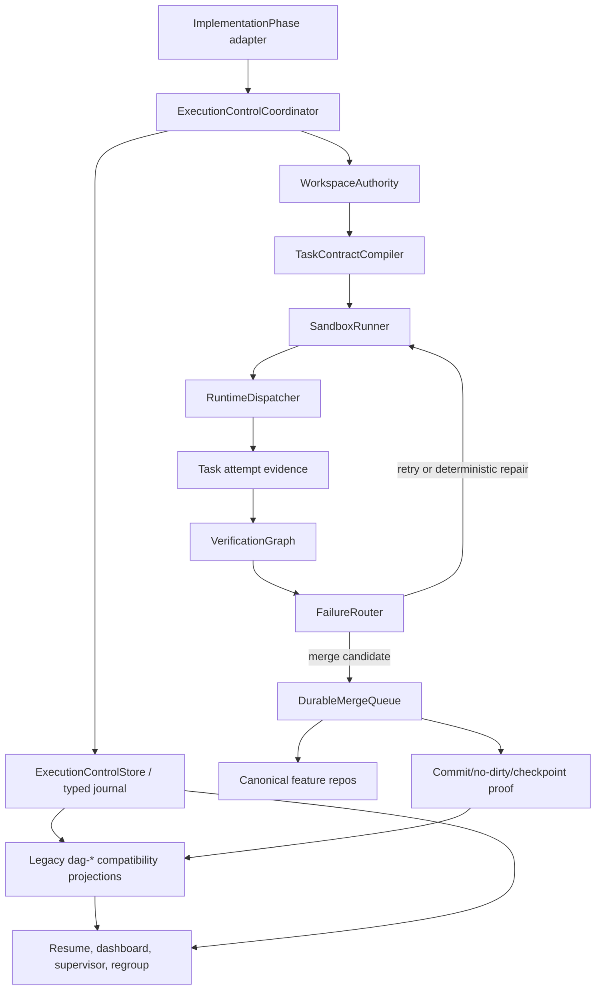

# Transactional Execution Control Plane

## Executive Summary

This documentation set is the implementation reference for replacing the current
DAG implementation loop with a transactional execution control plane. The target
architecture adds a workspace authority layer, task deliverable contracts,
isolated sandbox execution, typed failure routing, an explicit verification
graph, and a durable merge queue that owns canonical repository mutation.

The current executor has made substantial progress, especially after the G45+
semantic regrouping work, but feature `8ac124d6` exposed repeatable workflow
drag: worktree alias drift, ACL/writeability gaps, stale projection artifacts,
commit hygiene loops, claimed-file oscillation, and late verifier context drift.
Those are not isolated product defects. They are control-plane concerns that
should be handled before normal agent implementation, verification, RCA, or
operator escalation.

The target system keeps Postgres canonical, writes typed execution records, uses
legacy `dag-*` artifacts as compatibility projections, runs implementers in
sandboxes, and only checkpoints a group after merge queue success, raw gate
approval, commit proof, and no-dirty proof.

## Atomic Landing Stance

The execution control plane may be built and reviewed slice-by-slice internally,
but it does not land as a staged production rollout. The landing unit is one
complete feature: typed journal, workspace authority, contracts, sandbox runner,
dispatcher boundary, gates, failure router, merge queue, regroup feedback, and
supervisor/dashboard integration all enabled together after full validation.

Implications:

- Slice documents describe construction and validation order, not production
  exposure phases.
- Feature flags are temporary development, shadow, and test controls. They are
  not a license to partially ship product-authoritative behavior.
- A path cannot become product-authoritative until all cross-slice contracts,
  compatibility projections, resume behavior, merge/checkpoint recovery, and
  regression gates are green together.
- Existing in-flight legacy features are not silently migrated mid-run. After
  the complete control plane lands, the desired operating posture is to cut
  eligible in-flight features over as soon as the first safe checkpoint/quiesce
  boundary is reached, using an explicit adoption record and preflight rather
  than an implicit resume-path switch.
- Any subordinate document that uses rollout/phase language must be interpreted
  as internal build validation language until renamed. The architecture position
  is atomic landing after full validation.

## Landing Boundary

Production behavior has only two supported modes:

1. Existing legacy executor behavior for features that have not entered the
   control plane.
2. The complete execution control plane after the atomic landing gate has passed.

There is no supported production mode where only one slice owns authoritative
execution, merge, checkpoint, resume, dashboard, or supervisor behavior. Internal
development controls may exist to make tests, local runs, and staging validation
tractable, but those controls must fail closed and must not become per-slice
runtime product switches.

The only production enablement control is the final complete-bundle gate
described in [Atomic landing and acceptance matrix](12-rollout-and-acceptance-matrix.md).
That gate can enable new control-plane starts only after the full CI matrix,
projection parity, resume safety, queue recovery, bounded reads, dashboard and
supervisor integration, and operational go/no-go record are green together.

Rollback is whole-feature rollback or admission stop. It must preserve typed
audit rows, legacy compatibility projections already written, checkpoints,
active regroup markers, and merge/commit evidence. A partially queued or
partially checkpointed control-plane feature must not be handed to the legacy
direct-commit path.

## Architecture

Visual companion diagrams:

- [Implementation prompt](IMPLEMENTATION_PROMPT.md) is the handoff prompt for
  the coding agent that implements the full control plane. It requires
  restart-safe journaling, subagent implementation/review loops, and no
  progression between slices until targeted verification and P1/P2 review gates
  are clear.
- [Existing vs proposed execution flow](execution-flow-comparison.html) is the
  recommended comparison view. It aligns the current monolith flow with the
  proposed control-plane modules and includes toggles for existing, proposed,
  and changes-only views.
- [Existing workflow control/data flow](existing-workflow-control-data-flow.html)
  shows the current `ImplementationPhase` DAG loop, compatibility artifacts,
  direct canonical repo mutation, post-DAG gates, and post-test observation
  boundary.
- [Proposed control-plane control/data flow](proposed-control-plane-control-data-flow.html)
  shows the target typed journal, workspace authority, sandbox runner,
  verification graph, failure router, merge queue, compatibility projections,
  preserved post-DAG gates, and effective-DAG post-test guard.

## Architecture Contracts

The contracts below are implementation requirements, not design suggestions.

| Component | Owns | Reads | Writes | Must not do |
| --- | --- | --- | --- | --- |
| `ImplementationPhase` adapter | Legacy entrypoint, quiesce semantics, compatibility shims | Feature state, root DAG artifact, existing services | Control-plane start/stop calls and legacy projections only through the coordinator | Directly assemble new `dag-*` keys, decide checkpoint success, or mutate canonical repos for control-plane paths |
| `ExecutionControlCoordinator` | Feature-level orchestration and state-machine transitions | DAG, typed journal, workspace authority, contracts, queue state | Typed execution events, attempt state, routing decisions | Hide side effects inside prompts or runtime adapters |
| `ExecutionControlStore` / typed journal | Canonical execution records and projection transactions | Postgres, legacy artifact rows for reconstruction | Typed rows, projection links, compatibility artifacts in one transaction | Allow typed success without synchronous legacy visibility while consumers still depend on artifacts |
| Workspace authority | Canonical repo identity, alias mapping, ACL/writeability preflight, workspace snapshots | Worktree registry, filesystem/git metadata, feature config | Workspace snapshots and deterministic workspace failure records | Let an implementer start with unresolved alias, ACL, or dirty generated-output ambiguity |
| Task deliverable contracts | Execution-time allowed/required/forbidden outputs and gate requirements | DAG task specs, workspace authority, dependency/write-set data | Contract rows and contract verdict evidence | Treat a task result as proof that the contract was satisfied |
| Sandbox runner | Isolated work roots and patch capture | Contracts, workspace snapshots, runtime binding config | Sandbox attempt records, patch summaries, runtime evidence | Write directly to canonical feature repos or checkpoint from sandbox output |
| Runtime dispatcher | Provider-specific invocation boundary | Sandbox binding, task contract, retry budget | Attempt lifecycle records and `dag-task:*` attempt projections through the journal | Commit, checkpoint, or rewrite merge/commit proof |
| Verification graph | Raw gates, stale-context detection, gate evidence ordering | Contract ids, patch summaries, canonical/sandbox snapshots | Gate evidence and typed verification results | Approve merge on stale context or summary-only evidence |
| Failure router | Deterministic class-to-action routing | Typed failures, gate evidence, queue status, workspace evidence | Retry, repair, quiesce, or escalation decisions | Send workflow-class failures to broad product repair by default |
| Durable merge queue | Canonical apply, rebase/conflict handling, commit, no-dirty proof, checkpoint projection | Contracts, patches, gate evidence, base commits | Queue rows, commit proof, merge proof, `dag-group:*` projection | Rewrite `dag-task:*` or checkpoint without recoverable commit/no-dirty/projection proof |
| Supervisor/dashboard/regroup consumers | Read-only visibility and advisory feedback | Typed snapshots and compatibility projections | Bounded audit/action records where explicitly documented | Mutate executor/control-plane state or broaden reads beyond bounded APIs |

## End-To-End Implementation Path

The implementation should preserve this handoff order. Each handoff writes typed
evidence before the next component can rely on it.

1. `ImplementationPhase` remains the legacy entrypoint and delegates
   control-plane features to `ExecutionControlCoordinator`.
2. `ExecutionControlStore` opens or reconstructs typed feature state and writes
   synchronous legacy compatibility projections for readers that still consume
   `dag-*` artifacts.
3. Workspace authority resolves canonical repo identities, alias maps,
   writeability, ACL normalization evidence, and workspace snapshots before any
   implementer or repair work is dispatched.
4. Task contract compiler turns DAG intent into stable contract ids, path rules,
   required/forbidden outputs, acceptance criteria, and gate requirements.
5. Sandbox runner allocates isolated roots from workspace snapshots and contract
   scopes. It captures patch evidence; it never mutates canonical feature repos.
6. Runtime dispatcher invokes the selected provider with contract-bounded
   context and records attempt lifecycle, structured result evidence, and
   `dag-task:*` compatibility projections through the journal.
7. Verification graph runs deterministic raw gates, builds bounded verifier
   context from explicit evidence refs, records stale-context checks, and emits
   typed gate verdicts.
8. Failure router maps typed failures to retry, deterministic repair, queue
   recovery, quiesce, or operator escalation. Workflow/control-plane failures
   must not default to broad product repair.
9. Durable merge queue serializes canonical mutation: apply candidate patch,
   rebase or conflict, commit, prove no-dirty state, write merge/commit proof,
   and only then write `dag-group:*` checkpoint projection.
10. `ImplementationPhase` still runs the current post-DAG business gates after
    all groups checkpoint: code review, security audit, test authoring, QA,
    integration testing, final verifier, source-repo push, implementation
    report, backlog report, and completion notification. The control plane may
    replace how those gates get evidence and route fixes, but it must not bypass
    or weaken them.
11. `PostTestObservationPhase` may start only after the effective DAG, including
    any active regroup overlay, is complete. Its defensive entry guard must use
    typed completion state or the effective-DAG resolver, not root-DAG length
    alone.
12. Regroup, dashboard, and supervisor read bounded typed snapshots and
    compatibility projections. Their actions are advisory unless a slice
    explicitly documents a guarded, bounded write exception.

Implementation PRs may be sliced for review, but a product-authoritative path is
not complete until all twelve handoffs above are wired and validated together.

## State And Proof Boundaries

- `dag-task:*` means an attempted task produced evidence against a contract. It
  is not canonical integration proof, group completion proof, or checkpoint
  proof.
- `dag-verify:*` means a gate or verification pass ran with a recorded context.
  It is not sufficient for checkpointing unless the merge queue links it to the
  accepted candidate.
- `dag-merge-proof:*` and `dag-commit-proof:*` are merge queue outputs proving
  canonical apply, commit result, and no-dirty state for the candidate.
- `dag-group:*` remains the legacy checkpoint projection and is written only
  after queue success, gate evidence, commit proof, no-dirty proof, and
  idempotent projection all succeed.
- Typed rows are the source of truth for new control-plane decisions. Legacy
  artifacts are synchronous compatibility projections until every resume,
  dashboard, supervisor, regroup, and post-test consumer has migrated.
- Filesystem state, sandbox contents, logs, and Slack messages are evidence
  sources. They are never the canonical execution state.

## Document Index Guidance

Read this directory as an implementation contract set. Each slice must preserve
the global invariants below and must leave enough typed evidence for resume,
debugging, and rollback-safe internal validation.

1. [Evidence and current state](00-evidence-and-current-state.md): establishes
   the `8ac124d6` evidence baseline, current failure classes, and fixture
   expectations. Start here before changing behavior.
2. [Typed journal and compatibility projections](01-typed-journal-and-compatibility-projections.md):
   defines canonical typed storage and the atomic typed-row/artifact/projection
   transaction. Build before any component needs durable control-plane state.
3. [Workspace authority](02-workspace-authority.md): defines canonical repo
   identity, alias handling, ACL checks, snapshots, and deterministic workspace
   failure routing.
4. [Task deliverable contracts](03-task-deliverable-contracts.md): converts DAG
   intent into execution-time contracts used by prompts, patch validation,
   gates, repair, and merge.
5. [Sandbox runner](04-sandbox-runner.md): isolates implementers and repair
   agents from canonical repos and records candidate patches as evidence.
6. [Dispatcher runtime boundary](05-dispatcher-runtime-boundary.md): contains
   provider-specific invocation behavior and prevents runtime adapters from
   owning commit/checkpoint decisions.
7. [Gates and verification graph](06-gates-and-verification-graph.md): makes
   raw gates, bounded context, stale evidence checks, and verification ordering
   explicit.
8. [Typed failure router](07-typed-failure-router.md): maps failures to retry,
   deterministic repair, queue recovery, quiesce, or operator escalation.
9. [Durable merge queue](08-durable-merge-queue.md): owns canonical apply,
   commit, no-dirty proof, queue recovery, and checkpoint projection.
10. [Regroup overlay and scheduler feedback](09-regroup-overlay-and-scheduler-feedback.md):
    keeps scheduler speed subordinate to dependency, write-set, sandbox, merge,
    and checkpoint safety.
11. [Supervisor and dashboard integration](10-supervisor-dashboard-integration.md):
    defines bounded read models and advisory-only control surfaces.
12. [Refactor map](11-refactor-map.md): maps current `implementation.py`
    responsibilities to extracted modules while preserving monkeypatch and
    compatibility shims during construction.
13. [Atomic landing and acceptance matrix](12-rollout-and-acceptance-matrix.md):
    records complete-bundle readiness gates, metrics, CI matrix, operational
    go/no-go, and rollback rules. Its filename is historical; it must not be
    treated as a phased production rollout plan.
14. [13A. Lossless context and evidence completeness](13a-lossless-context-and-evidence-completeness.md):
    records the post-00-12 change-control remediation for exact-or-paged
    evidence, display previews, and completeness semantics before
    governance/context surfaces can use that evidence as execution authority.
15. [Governance evidence model](13-governance-evidence-model.md): defines the
    evidence model for governance analysis over typed journal rows, compatibility
    projections, commit proof, supervisor signals, resource metrics, and
    implementation journals.
16. [Commit and line provenance](14-commit-and-line-provenance.md): attaches
    workflow provenance to Git commits and line-level context while keeping
    Postgres typed state canonical.
17. [Governance metrics and scoring](15-governance-metrics-and-scoring.md):
    defines normalized workflow metrics, confidence, evidence quality, and
    plan-vs-actual scoring.
18. [Finding engine and taxonomy](16-finding-engine-and-taxonomy.md): converts
    evidence and metrics into deterministic governance findings.
19. [Policy recommendation interface](17-policy-recommendation-interface.md):
    defines advisory, evidence-backed policy recommendations for scheduler,
    router, supervisor, dashboard, and planning consumers.
20. [Counterfactual replay and simulation](18-counterfactual-replay-and-simulation.md):
    validates recommendations against historical execution evidence before they
    influence future workflow policy.
21. [Governance agent and reporting](19-governance-agent-and-reporting.md):
    defines governance CLI/API, dashboard, Slack, and agent-readable summaries.
22. [Governance acceptance and adoption](20-governance-acceptance-and-adoption.md):
    defines the all-at-once acceptance gate for the governance tool after
    Slices 00-12 and required 13A remediation are complete.
23. [IriAI context layer](21-iriai-context-layer.md): defines the
    provider-backed context service, optional GitAI/Engram/H5i adapters,
    NativeGit fallback, and IriAI lineage plugin that maps workflow evidence onto
    code spans for task-execute context.

Use the slice docs this way:

- Start with Slice 00 for evidence and regression fixtures before changing
  behavior.
- Use Slice 01 as the storage/projection contract for every later slice. If a
  component needs durable state, event history, idempotency, or legacy artifact
  visibility, the write shape belongs there.
- Use Slices 02 and 03 before dispatch work: workspace snapshots and task
  contracts are required inputs for sandbox allocation, prompts, gates, repair,
  and merge.
- Use Slices 04 and 05 for implementation/repair execution boundaries:
  sandbox roots and runtime adapters produce attempt evidence only.
- Use Slices 06, 07, and 08 for the checkpoint path: gate evidence feeds
  failure routing or merge queue, and only merge queue proof can produce
  `dag-group:*`.
- Use Slices 09 and 10 after the core execution path exists. They consume typed
  snapshots and projections for regroup feedback, dashboard, and supervisor; the
  v1 surface is read-only/advisory except for explicitly documented bounded
  audit/action records.
- Use Slice 11 as the extraction map for turning the current
  `implementation.py` responsibilities into modules while preserving test
  boundaries and compatibility shims during construction.
- Use Slice 12 as the final acceptance authority. It validates the complete
  bundle only, not independently shippable slice phases.
- Use Slice 13A as post-00-12 change control. Before editing any accepted or
  active slice, re-check the implementation journal and decision log.
  Accepted/in-flight slice plans should not be silently rewritten; exactness
  remediation belongs in 13A after the 00-12 landing or in an active slice's own
  review loop if that loop independently accepts it.
- Use Slices 13-20 after Slice 12 is complete. They are the governance tool
  feature family: analytical and advisory first, with implementation
  journals/logs treated as first-class evidence for plan-vs-actual analysis.
  Governance/context surfaces may not treat exact/paged evidence as execution
  authority until required 13A remediation is complete.
- Use Slice 21 after governance acceptance when agents need line-aware,
  workflow-aware task context. The context layer is advisory and provider-backed;
  `NativeGitProvider` is mandatory, while GitAI, Engram, and H5i are optional
  adapters.

## Governance Slice Review And Revision Cycle

Governance Slices 13-20 inherit the implementation journal discipline from
Slices 00-12. Each governance slice must add a slice execution brief to
`implementation-journal.md` and a decision row to
`implementation-decisions.jsonl` before implementation work starts.

For each governance slice:

1. Review the upstream Slice 00-12 plan docs, implementation journal entries,
   decision-log rows, acceptance records, reviewer findings, test outputs, and
   accepted deviations named in that slice's
   `Upstream Implementation Artifact Review` section.
2. Record which upstream deviations are compatible and which would block the
   governance slice.
3. Dispatch independent reviewers for existing workflow compatibility,
   implementation-artifact compatibility, evidence/provenance correctness,
   metric validity, self-improvement safety, and maintainability.
4. Patch every P1/P2 finding and redispatch reviewers.
5. Do not accept the slice until targeted tests pass and reviewers report no
   open P1/P2 findings.
6. Record acceptance, unresolved P3 follow-ups, and any superseded assumptions in
   both journals.

This cycle is part of the governance tool contract because governance analyzes
the real workflow implementation, not just the intended architecture.

## Slice Handoff Map

| Build area | Primary slice docs | Implementation output |
| --- | --- | --- |
| Evidence baseline | 00 | Failure taxonomy fixtures, metrics, and current-state anchors used by all slices |
| Typed journal and projections | 00, 01 | Canonical rows, idempotency keys, projection ownership, crash recovery, bounded artifact refs |
| Workspace authority | 00, 01, 02 | Canonical repo identities, alias verdicts, writeability/ACL evidence, workspace snapshots |
| Task contracts | 00, 01, 02, 03 | Stable contract ids, path rules, acceptance specs, required gate specs |
| Sandbox and dispatcher | 01, 02, 03, 04, 05 | Isolated attempt execution, patch evidence, structured result projections |
| Gates and router | 01, 03, 04, 05, 06, 07 | Raw gate verdicts, stale-context checks, retry/repair/quiesce/escalation decisions |
| Durable merge and checkpoint | 01, 02, 03, 04, 06, 07, 08 | Canonical apply, merge proof, commit proof, no-dirty proof, `dag-group:*` projection |
| Post-DAG and post-test gates | 01, 05, 06, 07, 08, 10, 11, 12 | Existing code review/security/test authoring/QA/integration/verifier/report/notification semantics preserved through typed evidence and effective-DAG completion guards |
| Regroup, dashboard, supervisor | 01, 06, 07, 08, 09, 10 | Bounded read models, advisory feedback, audit records, operator visibility |
| Refactor and landing gate | 01-10, 11, 12 | Extracted module boundaries, complete-bundle acceptance, whole-feature rollback plan |
| Governance analysis | 00-12, 13-20 | Evidence sets, commit/line provenance, metrics, findings, recommendations, replay, reporting, and governance acceptance |
| IriAI context layer | 03, 05, 06, 08, 13, 14, 16, 19, 20, 21 | Provider-backed task-execute context packages, NativeGit fallback, optional GitAI/Engram/H5i adapters, and IriAI lineage mapping from workflow evidence to code spans |

## Implementation Readiness Checklist

Before any review claims a control-plane path is implementation-ready, confirm:

- Every product-authoritative state transition has one owner, one typed row
  shape, one stable idempotency key, and one documented recovery behavior.
- Every legacy `dag-*` compatibility artifact has a source typed row, an owning
  component, an exact key/shape contract, and projection parity tests.
- Every dispatch, gate, repair, merge, checkpoint, resume, dashboard, and
  supervisor read uses bounded evidence refs or documented compatibility
  projections instead of broad artifact-body reads.
- Every workflow/control-plane failure class routes through typed failure
  records and cannot be silently recast as a product implementation defect.
- Every canonical repo mutation is owned by workspace authority metadata repair
  or durable merge queue product-content apply; implementers and repair agents
  only produce sandbox evidence.
- Every checkpoint requires linked gate evidence, merge proof, commit proof,
  no-dirty proof, and idempotent `dag-group:*` projection in the same recovery
  story.
- Every post-DAG business gate remains present and resume-safe. A completed
  group checkpoint authorizes feature-level review/testing/reporting to start;
  it is not itself the final implementation-phase approval.
- Active legacy features either stay on the legacy executor or restart under the
  fully validated control plane. There is no automatic mid-feature migration.
- Slice 12 has a complete-bundle go/no-go record before new control-plane
  starts are admitted in production.
- Governance docs and implementation must review the actual Slice 00-12
  implementation journal, decision log, reviewer findings, accepted deviations,
  and test outputs before treating the intended architecture as real evidence.
- Governance recommendations are advisory unless a later policy activation path
  explicitly owns mutation, tests, and rollback.

When adding or reviewing a slice, check that it answers:

- What typed rows are authoritative?
- Which legacy artifacts are projected, with what exact key and shape?
- Which component is the only writer for each artifact/proof?
- What is the idempotency key for retries and crash recovery?
- What evidence distinguishes product failure from workflow/control-plane
  failure?
- What tests prove projection parity, resume safety, bounded reads, and
  checkpoint safety?

## Current Code Anchors

- DAG execution and resume live in [_implement_dag](/Users/danielzhang/src/iriai/iriai-build-v2/src/iriai_build_v2/workflows/develop/phases/implementation.py:4647).
- Verify, repair, commit, and checkpoint are coordinated by [_verify_and_fix_group](/Users/danielzhang/src/iriai/iriai-build-v2/src/iriai_build_v2/workflows/develop/phases/implementation.py:2925).
- Worktree registry and setup are in [WorktreeRegistryRepo](/Users/danielzhang/src/iriai/iriai-build-v2/src/iriai_build_v2/workflows/develop/phases/implementation.py:1395), [WorktreeRegistry](/Users/danielzhang/src/iriai/iriai-build-v2/src/iriai_build_v2/workflows/develop/phases/implementation.py:1422), and [_ensure_task_worktrees](/Users/danielzhang/src/iriai/iriai-build-v2/src/iriai_build_v2/workflows/develop/phases/implementation.py:1635).
- Commit behavior is concentrated in [_commit_repos_in_root](/Users/danielzhang/src/iriai/iriai-build-v2/src/iriai_build_v2/workflows/develop/phases/implementation.py:5732) and [_commit_group](/Users/danielzhang/src/iriai/iriai-build-v2/src/iriai_build_v2/workflows/develop/phases/implementation.py:5904).
- DAG models are in [ImplementationTask](/Users/danielzhang/src/iriai/iriai-build-v2/src/iriai_build_v2/models/outputs.py:942), [ImplementationDAG](/Users/danielzhang/src/iriai/iriai-build-v2/src/iriai_build_v2/models/outputs.py:984), [DerivedDAGArtifact](/Users/danielzhang/src/iriai/iriai-build-v2/src/iriai_build_v2/models/outputs.py:994), and [ImplementationResult](/Users/danielzhang/src/iriai/iriai-build-v2/src/iriai_build_v2/models/outputs.py:1022).
- Artifact summary/detail APIs are in [artifacts.py](/Users/danielzhang/src/iriai/iriai-build-v2/src/iriai_build_v2/storage/artifacts.py:143) and [artifacts.py](/Users/danielzhang/src/iriai/iriai-build-v2/src/iriai_build_v2/storage/artifacts.py:242).
- Event summary APIs and advisory locks are in [features.py](/Users/danielzhang/src/iriai/iriai-build-v2/src/iriai_build_v2/storage/features.py:122) and [features.py](/Users/danielzhang/src/iriai/iriai-build-v2/src/iriai_build_v2/storage/features.py:164).
- Supervisor classification priority is in [classifier.py](/Users/danielzhang/src/iriai/iriai-build-v2/src/iriai_build_v2/supervisor/classifier.py:23).
- Sizing and process-improvement analysis is in [dag_regroup.py](/Users/danielzhang/src/iriai/iriai-build-v2/src/iriai_build_v2/workflows/develop/dag_regroup.py:1011) and [dag_regroup.py](/Users/danielzhang/src/iriai/iriai-build-v2/src/iriai_build_v2/workflows/develop/dag_regroup.py:1256).

## Research Citations

- [Anthropic: Building effective agents](https://www.anthropic.com/engineering/building-effective-agents?guides=understanding-tradeoffs): prefer simple composable workflows, explicit routing, parallelization only for independent work, and strong agent-computer interfaces.
- [Anthropic: Effective harnesses for long-running agents](https://www.anthropic.com/engineering/effective-harnesses-for-long-running-agents?lid=1f0n56CPItf3Nm9NR): long-running agent work needs harnesses, durable state, and observable checkpoints.
- [Anthropic: Scaling managed agents](https://www.anthropic.com/engineering/managed-agents): decouple high-level reasoning from tool execution and use explicit control surfaces for agent action.
- [GitHub Docs: Merge queue](https://docs.github.com/en/repositories/configuring-branches-and-merges-in-your-repository/configuring-pull-request-merges/managing-a-merge-queue): serialize risky integration through a queue that validates candidates before merge.
- [Temporal documentation](https://docs.temporal.io/): durable workflow execution and resumable state machines are the right model for long-running feature workflows.
- [AWS durable execution idempotency](https://docs.aws.amazon.com/durable-execution/patterns/best-practices/idempotency/): retries must be idempotent and side effects must use stable keys.
- [Microsoft event sourcing](https://learn.microsoft.com/en-us/azure/architecture/patterns/event-sourcing): append-only event history is useful for reconstruction, audit, and derived projections.
- [Bazel sandboxing](https://bazel.build/docs/sandboxing): isolated execution prevents hidden dependencies and catches undeclared inputs/outputs earlier.

## Global Invariants

- Postgres typed state is canonical for the control plane. Filesystem mirrors,
  sandbox contents, provider logs, and Slack messages are supporting evidence.
- Legacy `dag-*` artifacts remain synchronous compatibility projections until
  all consumers migrate. Projection parity is a hard acceptance gate.
- Every product-authoritative side effect has a stable idempotency key. Retries
  must either no-op, complete the same transition, or create a typed failure
  that the router can classify.
- `dag-task:*` is task-attempt evidence, not group completion proof.
  Dispatcher/journal is the sole writer for `dag-task:*`; merge queue writes
  merge/commit proof and `dag-group:*`.
- `dag-group:*` is written only after verification, merge, commit, no-dirty
  proof, and checkpoint projection succeed. Crash recovery must be able to
  reconstruct whether each prerequisite happened.
- Post-DAG gate checkpoints such as `dag-gate:code-review`,
  `dag-gate:security`, `dag-gate:test-authoring`, `dag-gate:qa`,
  `dag-gate:integration`, and `dag-gate:verifier` remain feature-level business
  logic. The control plane must preserve their current resume behavior and route
  their failures through typed verification/router paths before
  `PostTestObservationPhase` can begin.
- Implementers and repair agents do not write directly to canonical repos in the
  target architecture. Product-content mutation belongs to merge queue workers.
  Workspace authority may perform bounded pre-dispatch metadata repair inside
  canonical feature repo roots only: chmod/chgrp/setgid and identical-content
  file replacement needed to make runtime-user writes possible. Those mutations
  are recorded as workspace evidence and must not change product bytes.
- Workspace authority must resolve canonical repo/path identity and agent-user
  writeability before dispatch. Alias-only, divergent alias/canonical, ACL, and
  dirty generated-output cases fail closed into deterministic workflow repair.
- Task contracts are the shared boundary for prompts, sandboxes, gates, repairs,
  and merge queue checks. Evidence that is not tied to a contract id is not
  enough to checkpoint.
- Gate decisions must record the exact context used. Summary-only or stale
  verifier context cannot approve canonical merge.
- Commit hygiene, stale projection, workspace/ACL, runtime-provider, and queue
  recovery failures are workflow/control-plane classes unless typed evidence
  proves they are product implementation failures.
- Supervisor is read-only/advisory for executor, control-plane, and product
  state in v1. Bounded audit/action records and explicitly configured guarded
  bridge actions are the only documented exceptions.
- Scheduler speed never overrides dependency, write-set, sandbox, merge, or
  checkpoint safety.
- The control plane lands atomically after full validation. Internal slice
  sequencing must not create partially shipped product-authoritative behavior.
- Active feature `8ac124d6` is evidence for this architecture, not the first migration target.
